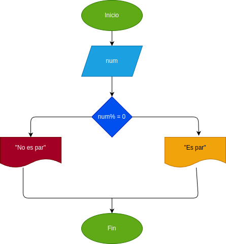

# Par_Impar
Programa para verificar si un numero es par o impar 

# input
### processing
si n: n % 2 = 0 se determina que es par 

si n : n % 2 = 1 se determina inpar 

### output
respuesta 
# Diseño

# Construccion

